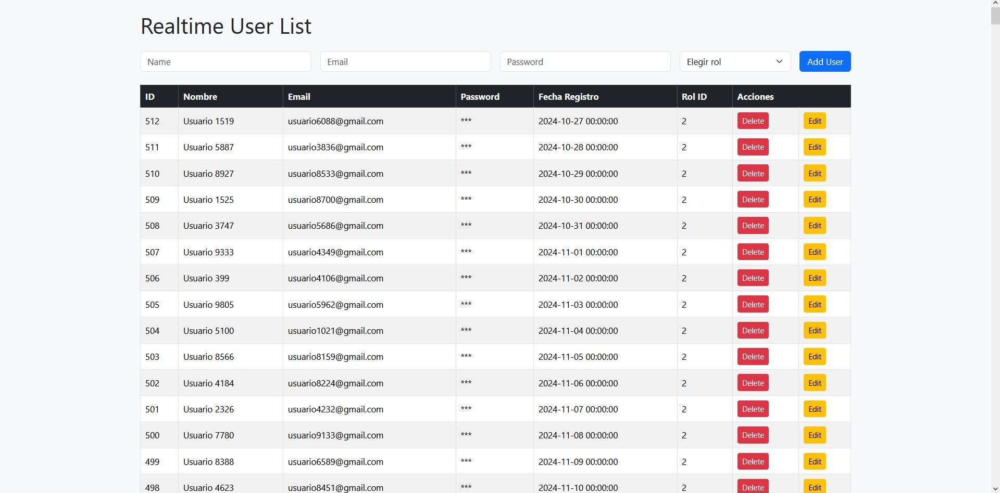

# Sistema Web de Gestión de Usuarios con Actualización en Tiempo Real Usando PHP

Este proyecto es una aplicación web para la gestión de usuarios, que permite crear, editar, eliminar y listar usuarios con una interfaz responsiva. Incluye actualizaciones en tiempo real para reflejar los cambios instantáneamente en la interfaz de usuario.

## Dashboard

_A continuación se muestra una imagen alusiva al dashboard de usuarios:_



## Tecnologías utilizadas

- **Frontend:** HTML, Bootstrap
- **Backend:** PHP (API RESTful)
- **Base de datos:** MySQL
- **WebSocket:** Node.js

## Estructura del proyecto

```
db/
    clicktesting.sql
frontend/
    index.html
php-api/
    create_user.php
    db.php
    delete_user.php
    edit_user.php
    get_users.php
ws-server/
    server.js
package.json
```

## Instalación y configuración

1. **Clona el repositorio en tu servidor local.**

2. **Configura la base de datos:**
   - Importa el archivo `db/clicktesting.sql` en tu servidor MySQL para crear la base de datos y las tablas necesarias.

3. **Configura el backend PHP:**
   - Asegúrate de que tu servidor Apache (XAMPP, WAMP, etc.) esté corriendo y que la carpeta `php-api` sea accesible desde el navegador.

4. **Instala las dependencias de Node.js para el servidor WebSocket:**
   - Abre una terminal en la carpeta `ws-server` y ejecuta:
     ```
     npm install
     ```

5. **Inicia el servidor WebSocket:**
   - Desde la carpeta raíz del proyecto, ejecuta:
     ```
     node ws-server/server.js
     ```

6. **Abre el frontend:**
   - Accede a `frontend/index.html` desde tu navegador.

## Uso

- Gestiona usuarios desde la interfaz web.
- Los cambios realizados (crear, editar, eliminar) se reflejan en tiempo real gracias a la integración con WebSocket.

## Notas

- Asegúrate de que el servidor WebSocket esté corriendo antes de usar la aplicación para que las notificaciones en tiempo real funcionen correctamente.
- Puedes modificar la configuración de la base de datos en `php-api/db.php` según tus necesidades.

---

Desarrollado por John Muñoz.